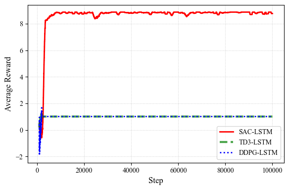

# Reinforcement Learning False Data Injection Attack (FDIA) Detection for HEMS

This project implements a reinforcement learning-based False Data Injection Attack (FDIA) detection agent designed for Home Energy Management System (HEMS) data. It leverages a combination of Graph Attention Networks (GAT) and Long Short-Term Memory (LSTM) layers, alongside state-of-the-art Reinforcement Learning algorithms, to accurately detect and isolate compromised data points in smart grid environments.

## Overview

The dataset is initially sourced from [Pecan Street](https://www.pecanstreet.org) and contains load information from multiple households. This repository focuses on the first residence's data.

The system uses a Graph Attention Network (GAT) forecaster integrated with an LSTM layer (`GAT_HEMS_model/GAT_LSTM.py`). This GAT-LSTM model assigns an **FDIA score** to each load value (represented as nodes in a graph). By ranking these scores, the model identifies and localizes the injected false data.

To dynamically adapt to varying attack patterns, the project compares several RL agents:
- **Soft Actor-Critic (SAC)** with LSTM
- **Deep Deterministic Policy Gradient (DDPG)**
- **Twin Delayed Deep Deterministic (TD3)** Policy Gradient

These RL agents process the environment state to produce an **adaptive threshold** for FDIA detection. Any data point with an FDIA score exceeding this adaptive threshold is flagged as an attack.

The results show that the **LSTM-based SAC** RL agent achieves the best performance.


## Installation

To run this project, clone the repository and install the dependencies:

```bash
pip install -r requirements.txt
```

## Usage

This project uses a unified command-line interface `run.py` to execute both the GAT-LSTM forecaster training/testing and the RL agents training/testing.

### Command Line Interface

```bash
python run.py --model {sac,gat,td3,ddpg,preprocess} --mode {train,test} [extra_args]
```

- `--model`: Choose the model/agent to run (`sac` for SAC RL Agent, `gat` for the GAT-LSTM forecaster, `td3`, `ddpg`, or `preprocess` to prepare data). Defaults to `sac`.
- `--mode`: Choose whether to `train` or `test`. Defaults to `train`.

Any extra arguments provided will be automatically forwarded to the underlying scripts. Use `--help` on the specific model scripts to view the available extra arguments.

### Examples

**1. Data Preprocessing**
Before training the models, generate the required scaled and attacked datasets.
*Note: This step requires `data.csv` (requested from Pecan Street) to exist in the `data/` directory.*
```bash
python run.py --model preprocess
```

**2. Train the GAT-LSTM Forecaster Model**
Before running the RL agents, you need to train the GAT-LSTM model.
```bash
python run.py --model gat --mode train --epochs 50 --batch_size 32
```

**3. Test the GAT-LSTM Forecaster Model**
```bash
python run.py --model gat --mode test
```

**4. Train the SAC RL Agent**
```bash
python run.py --model sac --mode train --epochs 100 --steps_per_epoch 1000
```

**5. Test the SAC RL Agent**
```bash
python run.py --model sac --mode test
```

## References
[1] Haarnoja, T., Zhou, A., Abbeel, P., & Levine, S. (2018). *Soft Actor-Critic: Off-Policy Maximum Entropy Deep Reinforcement Learning with a Stochastic Actor*. Proceedings of ICML. https://arxiv.org/abs/1801.01290
